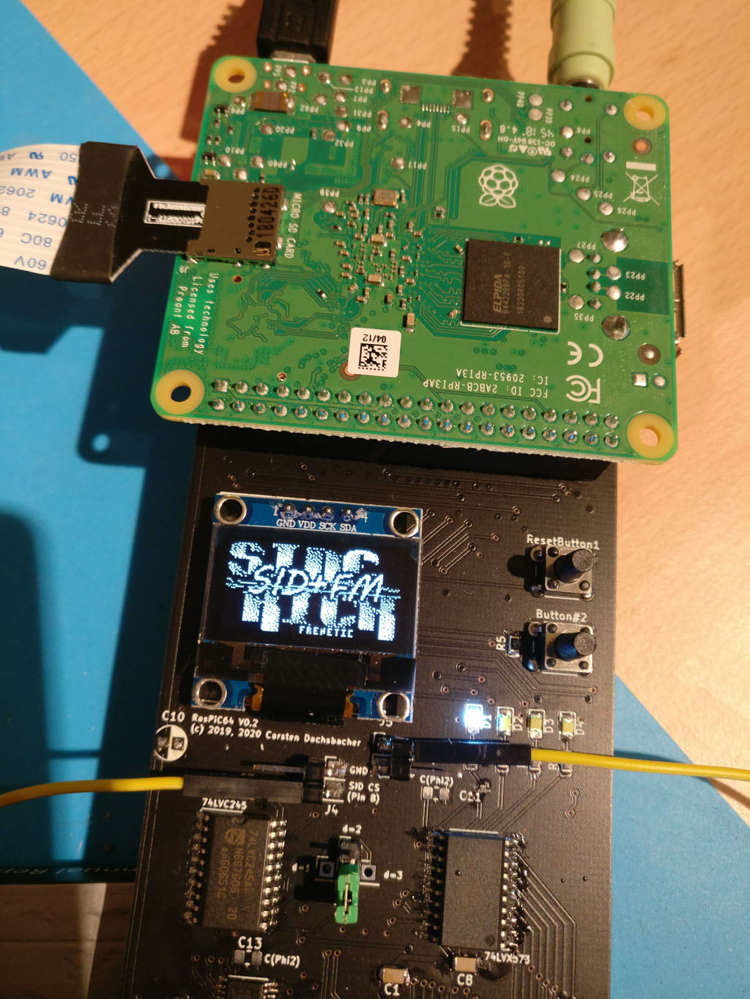
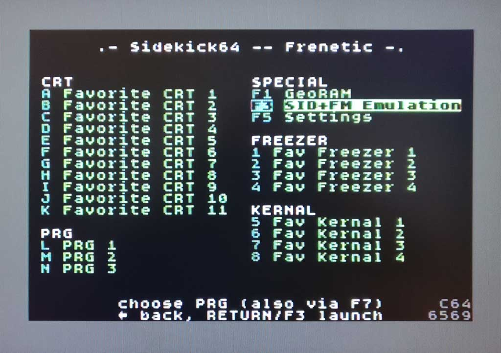
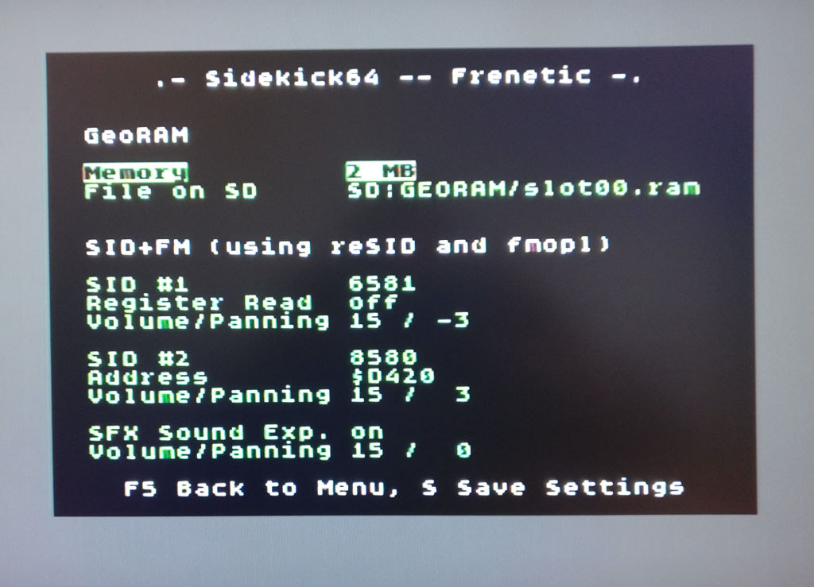
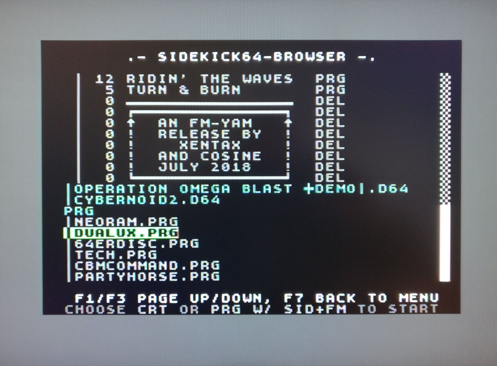

# Sidekick64

Sidekick64 is a versatile cartridge/expansion for the C64, C128, and the C16/+4. Its functionality is entirely defined by software running on a Raspberry Pi 3 (RPi). 
The connecting circuitry is quite simple and does not include any programmable ICs. Currently implemented features include the emulation of
- a GeoRAM/NeoRAM-compatible memory expansion, 
- Action Replay 4.x-7.x and Final Cartridge 3(+) freezer cartridges,
- Easyflash, MagicDesk, CBM80, C16/+4 and C128 cartridges, 
- C64 kernal replacement,
- Function ROMs on a C128, or 
- multiple SIDs and Sound Expander/FM emulation (up to 8 SIDs, e.g. to play [The Tuneful 8](https://csdb.dk/release/?id=182735))
- TED-sound and Digiblaster emulation for C16/+4 (to have all sound devices on one output)

But many more things are imaginable, e.g. 80 column cards with HDMI video output, custom accelerators/coprocessors etc. 

Sidekick64 is a result, or cumulation, of the RasPIC64 project, which is the framework enabling a RPi to bidirectionally communicate on the bus of a Commodore 64/128. 
Currently, Sidekick64 is set up to work with a Raspberry Pi 3A+ or 3B+ and has only be tested with various PAL-machines (C64 revisions, C128, C128D), C64 NTSC, C16/+4 (PAL, PAL-N, NTSC).
To the C64/+4 Sidekick64 is connected using a simple adapter.

       

Sidekick64 comes with a menu with a configurable main screen (for frequently used features, programs, cartridges), a configuration screen, and a file browser.
The C16/+4 version comes with two fabolous games ported to run directly off the emulated memory expansion: Alpharay and Pet's Rescue! Here's a [video](Video/Sidekick64_ElectricCity_by_Flex.mp4) of Sidekick64 emulation SIDs and playing [Electric City](https://csdb.dk/release/?id=189742) by Flex.

## How does it work? (technical details)

On the hardware side connecting the computers to the RPi requires level shifting to interface the 5V bus with the 3.3V GPIOs of the RPi. 
However, things get a bit more complicated: communication on the data lines needs to be bidirectional, 
the RPi needs to get hands off the bus when it's not its turn. 
And even worse, there are too few GPIOs on a standard RPi to simply connect to all signals! 
For the aforementioned use cases, we need to read address lines A0-A13, IO1, IO2, ROML, ROMH, Phi2, Reset, SID-chipselect, 
R/W and read/write data lines D0-D7 (plus GPIOs for controlling the circuitry). This makes the use of multiplexers necessary. 
Additionally we also need to control GAME, EXROM, NMI, DMA and RESET, and, very important :-), drive an OLED or TFT display and LEDs.

On the software side, handling the communication is time critical. The communication needs to happen within a time window of approx. 500 nanoseconds (or less on C16/+4, C128). 
This includes reading the GPIOs, switching multiplexers and reading again, possibly figuring out which data to put on the bus, doing so -- and getting hands off again on time. 
Many of these steps obviously must not happen too late, but also not too early (e.g. some signals might not be ready). Just sniffing the bus, e.g. getting SID commands and
 running an emulation is less time critical than reacting, for instance when emulating a cartridge. In this case one has to put the next byte on the bus and if too late, the C64 will most likely crash. That is, in addition to careful timing – and this turned out to be the most complicated part on the RPi – we also must avoid cache misses. 

I implemented the communication in a fast interrupt handler (FIQ) which handles GPIO reading, preloads caches if required, and reacts properly. 
The timing is done using the ARM's instruction counters. I use Circle (https://github.com/rsta2/circle) for bare metal programming the RPi which provides a great basis.
 Unfortunately other features which require IRQs (e.g. USB) interfere with the FIQ and do not work (yet -- or least not without halting the CPU of the 8-bit machine). 

## What’s in the repository

In the repo you’ll find Gerber files to produce the Sidekick64-PCB, which plugs to the C64’s expansion port on one side, and to the Raspberry Pi (3A+/3B+-model only) on the other one.
It also contains various smaller example programs (I recommend looking at 'kernel_cart' and 'kernel_georam' first) and also the Sidekick64 software which glues together 
various functionalities (RAM expansion, sound emulation, kernal replacement, Easyflash/MagicDesk .CRT, and PRG launching). 
This also requires some code compiled to run on the 8-bit machine. For convenience, I added a complete image which you can copy to an SD-card and get started right away.

## Setting up the hardware (updated for revision 0.41)

Step 1 is obviously building the PCB, it only uses simple (SMD) components:

| IC/count  |      value |
|----------|:-------------|
| U1 		| 74LVX573/74LVC573 Package_SO:SO-20_12.8x7.5mm_P1.27mm | 
| U2,U3 		| 74LVC245 Package_SO:SO-20_12.8x7.5mm_P1.27mm| 
| U5, U7, U8 	| 74LVC257 Package_SO:SOIC-16_3.9x9.9mm_P1.27mm | 
| U6 		| 74LVC07 Package_SO:SOIC-14_3.9x8.7mm_P1.27mm| 
| U9 		| 74HCT30 Package_SO:SOIC-14_3.9x8.7mm_P1.27mm| 
| 4 		| LEDs | 
| 4 		| 0805 resistors for LEDs (I used 1.8k for bright LEDs)| 
| 5 		| 0805 10k-20k pullups | 
| 1 		| 0805 100k pullup | 
| C10 		| 0805 10uF X5R MLCC | 
| 2 	| 0805 10pF not required (leave out) | 
| 9	| 0805 100nF| 
| pin		| connection to HIRAM-pin of the CPU, can be left open if not used | 
| pin		| connection to SID chip select, can be left open if not used | 
| A13-BTN		| jumper to select whether the RPi reads A13 or signals from the middle button, currently the latter is not used  | 
| d=0..3		| jumper for configuring signal delays (see below) | 

You also need some pinheaders (obviously), a 2x20 female pin header, and buttons. And optionally (but recommended) a SSD1306 OLED (4 pin connector) or a ST7789 RGB-TFT with 240x240 resolution. 
The GND/VCC pins of the displays or configured using solder pads.

Two pins connect the Sidekick64-PCB to the HIRAM-signal of the CPU (pin 28, required for kernal-replacement) and the SID chip-select (pin 8, required for SID-emulation). These two signals are unfortunately not available at the expansion port. 
If you do not connect them, the respective functionality will not work (obviously).

d=0..3 is an external delay of the multiplexer switching signal. For the C64/C128 us a jumper connecting the pins in the d=0 columns. For the C16/+4 connect the d=3 column!

## Quick start

The easiest way (and probably the one most will use) is to copy the image onto an SD card. It contains the main Sidekick64-software combining various functionality accessibly from a menu. 
You can configure this menu by editing SD:C64/sidekick64.cfg and copying your Easyflash/MagicDesk/CBM80 .CRTs (others not supported), .PRG, .D64s, Final Cartridge 3/Action Replay >4.x CRTs and kernal ROMs (.bin raw format) to the respective subdirectories.
You can also create custom logos to be used with Easyflash .CRTs (.raw format for the OLED, .tga for the RGB-TFT), or modify the appearance on the TFT completely (see SD:SPLASH).

From the menu you can select/browse (should be self-explanatory), by pressing the RESET-button for 1-2 seconds you get back to the main menu from other functionalities. 
Sometimes 'button #2' has extra function (e.g. freezing, reactivating Sideback after exit to basic, toggle visualization in sound emulation, ...). 
You can also combine Geo/NeoRAM with kernal-replacement and then launch a program, or use sound emulation (currently: analog output) with the .PRG launcher.

IMPORTANT: when using a SID (or replacement) which supports register reading (= essentially all but the non-Ultimate SwinSIDs) then run the SID+FM emulation only with *register read* in the settings menu turned *OFF*. Otherwise the RPi and the SID may write to the bus at the same time, and this may not be a good idea.

# Powering the Raspberry Pi

Normally you would use an external power supply for the RPi. Although the circuitry has pull-ups/pull-downs to not mess with the bus at boot time, the safest way is to boot the RPi first and then turn on the C64.
The RPi is ready when the splash screen appears.

Use the following on your own risk (I do this, and it never destroyed anything, but as said - your choice): the latest revision offers to solder pads to grab the +5V supply from the C64. You can either connect a USB-cable and power
the RPi this way, or close the jumper "close to power..." to power the RPi via the +5V GPIO. NEVER power the RPi from the C64 and externally at the same time. NEVER! The current of the RPi has been measured to be up to 450mA which is within
the specificiations of the C64. In any case I recommend to not try powering the RPi with a standard PSU/brick of death.

## Sidekick128 for C128

The menu software is the very same as for Sidekick64 -- it detects automatically when running on a C128, and scans the PRG128 and CRT128 folders on the SD-card in this case. It can launch PRGs in C128 mode and emulate cartridges and external function ROM.

Attention: the Easyflash emulation supports reads in 2MHz Turbo Mode on the C128. This is a bit on the edge of the RPi speed. If you experience instabilities, you might want to slightly overclock (see SD:sidekick64.txt). Again please be aware that overclocking may void warranty.

## Sidekick264 for C16 and +4

Sidekick264 requires a passive adapter (Gerber files and schematics are in the repo) to be put between the C16/+4 expansion port and the Sidekick64. 
The Sidekick264 provides the very same menu and browser as the C64/C128 version, and supports PRG loading and C1low/C1high cartridges. 
As a bonus it can be used as Dual-SID-card (addresses $FD40 and $FE80), as FM-card (I chose address $FDE2), can emulate TED-sound and Digiblaster output. 
And -- until recently without any use case :-) -- a Geo/NeoRAM-compatible memory expansion (registers at $FDE8-$FDEA, memory window at $FE00-$FE7F). The latest update of Sidekick264 contains Alpharay and Pet's Rescue modified to run directly off the emulated NeoRAM! The SD Card contains example programs with source to demonstrate these functionalities.

Attention: Sidekick264 requires to overclock your RPi (see SD:sidekick264.txt). Please be aware that this may void warranty.

Note that on a +4 you will need to press the computer's own reset button instead of the one on the Sidekick PCB. 
This is annoying and because the +4 does not reboot on a reset signal at the expansion port. 
There is a simple hardware fix which would require to bridge pin 2 and 12 of a 7406 to make /RESET = /BRESET (thanks for this hint kinzi!), e.g. using a wire with test hooks. 
Note this is not needed, the Sidekick software will work around if you use the computer's reset button.

The PCB has one pin "C1Hi" which you need to connect to the Sidekick64 pin "SID CS". Note that this is only required if you want to use cartridges which use the C1Lo and C1Hi range. Please double check that you set the d=3 jumper on the Sidekick64 PCB (see above).

## Sidekick20 for VIC20

Rumors say that ... :-)

## Known limitations/bugs

Please keep in mind that you're not reading about a product, but my personal playground that I'm sharing. Not all kinds of .CRTs are supported (in fact only generic carts, Easyflash (without EAPI), Magic Desk, Final Cartidge 3 and Action Replay). Not all kinds of disk images are supported (I only tried D64, D71 might work, D81 not). At (hopefully rare occasions) there might be some glitches due to cache misses, e.g. a EF-CRT might not start on the first try, the FC3 freezer might crash, or launching a PRG does not work right away (press reset in all cases and it should be all fine afterwards).

## Building the code (if you want to)

Setup your Circle40+ and gcc-arm environment, then you can compile Sidekick64 almost like any other example program (the repository contains the build settings for Circle that I use -- make sure you use them, otherwise it will probably not work). Use "make -kernel={sid|cart|ram|ef|fc3|ar|menu}" to build the different kernels, then put the kernel together with the Raspberry Pi firmware on an SD(HC) card with FAT file system and boot your RPi with it (the "menu"-kernel is the aforementioned main software). 

The C64 code is compiled using cc65 and 64tass.

## Videos

I added two videos showing life captures of the C64 screen where the RPi is used as a "graphics coprocessor" for rendering an image using rasterization or path tracing (light transport simulation). This is just meant to show case that the RPi can be used for more than just emulating existing cartridges/hardware. The source code is not yet included in the repository, contact me if you are interested.

## Disclaimer

Be careful not to damage your RPi or C64, or anything attached to it. I am not responsible if you or your hardware gets damaged. In principle, you can attach the RPi and other cartridges at the same time, as long as they do not conflict (e.g. in IO ranges or driving signals). I recommend to NOT do this. For example, using Sidekick and an Easyflash 3 will very likely destroy the EF3's CPLD. Again, I'm not taking any responsibility -- if you don't know what you're doing, better don't... use everything at your own risk.

## License

My portions of the source code are work licensed under GPLv3.

The PCB is work licensed under a Creative Commons Attribution-NonCommercial-ShareAlike 4.0 International License.

## Misc 

Last but not least I would like to thank a few people and give proper credits:

kinzi (forum64.de, F64) for lots of discussions and explanations on electronics and how a C64 actually works, Kim Jørgensen for chats on weird bus timings and freezers, and hints on how to get things right, and the testers on F64 (bigby, emulaThor, kinzi).
Rene Stange (the author of Circle) for his framework and patiently answering questions on it, and digging into special functionality (e.g. ARM stubs without L1 prefetching). Retrofan (https://compidiaries.wordpress.com/) for sharing his new system font which is also used in all recent releases, and for the Sidekick logo. And of course thanks a lot to Mad^BKN for porting Alpharay and Pet's Rescue in an amazingly short time! 
The authors of reSID and the OPL emulators (also used in WinVICE), the authors of SSD1306xLED (https://bitbucket.org/tinusaur/ssd1306xled, which I modified to work in this setting) for making their work available. The code in the repo further builds on d642prg V2.09 and some other code fragments found on cbm-hackers and codebase64.org. The OLED-Sidekick logo is based on a font by Atomic Flash found at https://codepo8.github.io/logo-o-matic. The C16/+4 SID and FM examples are based on code by Mr.Mouse/Xentax and Antti Hannula's (flex) 2sid tune "Eternity" (original mod by Matt Simmonds); the FM songs are Koere and Like Galway by Jesper Olson (jo). The C16 cartridge startup code is based on CBMHARDWARE's example.

### Trademarks

Raspberry Pi is a trademark of the Raspberry Pi Foundation.
